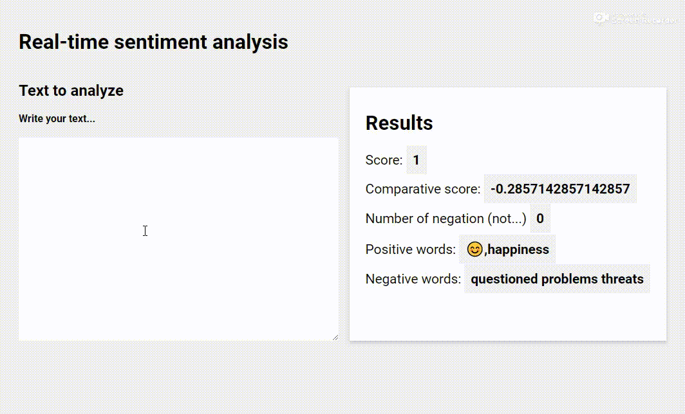

# Real-time sentiment analysis
_Tool for doing an AFINN sentiment analysis on user input in real time._

## Preview 

## Usage 

- Download the repo
- Run `npm install`
- Run `npm start`
- Go to `http://localhost:1234` with Google Chrome (has not been tested on other browsers)

